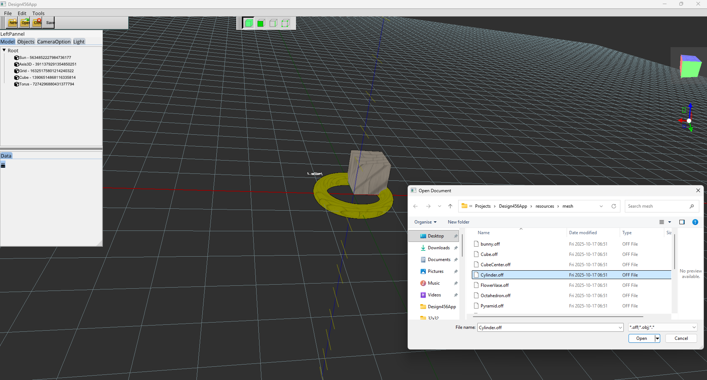

# Design456App
WIP!!!!!!

Turn Design456 Workbench to more powerful software. Combine GLFW, Imgui ImGuimzo in to one application.

# Notes:
This is an expermental pieces of code. Please don't use it in any serious application. 
It is still in very earliy development phase and I need more time to make it useful. 
Only Windows is supported at the moment. Glad is 4.x.

# Status:
After a failure try to add ECS both EnTT and Flecs, I returned back the code to the position before adding them. 
Now I have to find another way to add a container that is more powerful than just a vector. 
The code will not compile for a while. So please notice that. 
For the trial codes regarding EnTT or Flecs, you find diff branches. I will keep these branches if anyone would like to know why they failed. In short, objects gets deleted even so they are added to the ECS system.

Don't forget that you need to download preemake5.exe 

# Some Ideas are comming from:
Some of the code is inspired by TheCherno (thaks) and Hazel Game Engine. 

-------------------------------------------------

