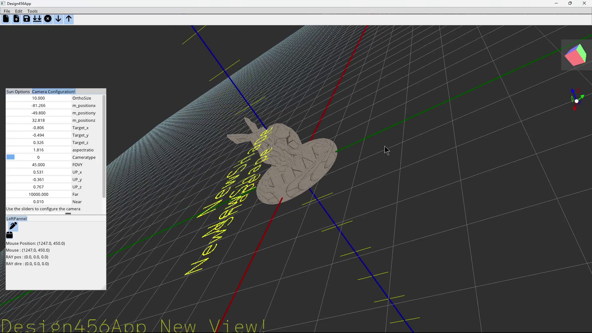

# Design456App

**WIP (Work In Progress)!!**

Turn the Design456 Workbench into a more powerful software application by combining GLFW, ImGui, and ImGuizmo into one application that run under FreeCAD.

## Notes
This is an experimental piece of code. Please don't use it in any serious application. It is still in a very early development phase, and I need more time to make it useful.

**Only Windows is supported at the moment. Glad is version 4.x.**

## Status
- Issues with ImGui; the Windows GUI is not fully functional yet.
- Support for Linux is almost there, it compiles but has some bugs which doesn't happen in Windows. :( 
- Significant work has been done for code cleanup and fixing redundant code.
- The base application is ready for further development, but the NaviCube feature is not yet implemented, and detection of vertices, lines, faces, and objects is in the early stages.
- Libraries are now included, to allow user to compile fully the project. 
- There is thinking of combining all libraries into one library libfrtk.a/so. It should work but some testing is required. 
- Compilation in Linux due to the library creating is somehow slow. I will look at that later. 
- Suggestions are welcome, as this code is still not at the quality I aspire to achieve. Development time is limited.
- I discovered that FLTK and GLFW are not a good combination. I attempted some code, which you can find in the frozen version, but that concluded my efforts with this approach.
**Please ensure you download `premake5`.**

## Acknowledgments
- This project started by modifying the https://github.com/gligneul/Scene-Graph. Thanks go to Gabriel de Quadros Ligneul (gligneul)
- Some of the code is inspired by TheCherno and the Hazel Game Engine. Thanks!

-------------------------------------------------

